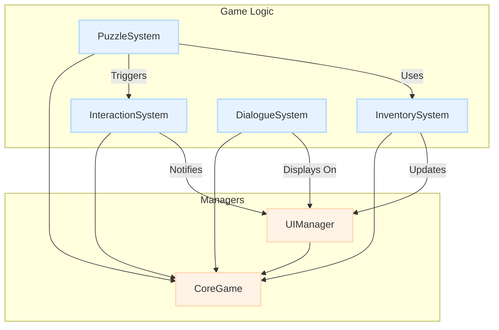

# C++ 模块详细说明

**最后更新**: 2025-12-07
**负责人**: 主架构师 (Manus)

---

## 1. 概述 (Overview)

本文档详细描述了《锈湖：炼金术士的天体仪》项目中所有核心C++模块的功能、职责和公共API。技术规划Manus对话将基于此文档进行具体的C++类和函数设计。每个模块都旨在成为一个独立、可复用的功能单元。

## 2. 模块依赖关系图



## 3. 核心模块详解

### 3.1 CoreGame (核心游戏模块)

该模块是整个游戏的中枢神经系统，负责管理游戏的生命周期和核心状态。

| C++ 类 | 职责描述 |
| :--- | :--- |
| `UGameManager` | (GameInstance Subsystem) 全局单例，管理章节切换、加载/卸载子关卡、处理游戏存档和读档请求。 |
| `URustyLakeSaveGame` | (SaveGame Object) 定义了需要被持久化存储的所有数据，包括谜题状态、背包物品、玩家位置等。 |

**关键API (UGameManager):**
```cpp
// 加载指定章节
UFUNCTION(BlueprintCallable, Category = "GameManager")
void LoadChapter(FName ChapterName);

// 保存游戏到指定槽位
UFUNCTION(BlueprintCallable, Category = "GameManager")
void SaveGame(int32 SlotIndex);

// 从指定槽位加载游戏
UFUNCTION(BlueprintCallable, Category = "GameManager")
void LoadGame(int32 SlotIndex);
```

### 3.2 InteractionSystem (交互系统模块)

提供了一个通用的、事件驱动的交互框架。

| C++ 类/接口 | 职责描述 |
| :--- | :--- |
| `IInteractable` | (Interface) C++接口，定义了所有可交互对象必须实现的行为，如`OnInteract`、`OnBeginFocus`、`OnEndFocus`。 |
| `UInteractionComponent` | (Actor Component) 附加在PlayerController上，负责从玩家视角发射射线，检测并与实现了`IInteractable`接口的对象进行交互。 |

**关键API (IInteractable):**
```cpp
// 当玩家点击对象时调用
UFUNCTION(BlueprintNativeEvent, BlueprintCallable, Category = "Interaction")
void OnInteract(AActor* Interactor);

// 当玩家视线开始聚焦于对象时调用
UFUNCTION(BlueprintNativeEvent, BlueprintCallable, Category = "Interaction")
void OnBeginFocus();

// 当玩家视线离开对象时调用
UFUNCTION(BlueprintNativeEvent, BlueprintCallable, Category = "Interaction")
void OnEndFocus();
```

### 3.3 InventorySystem (背包系统模块)

管理玩家在游戏中收集的物品。

| C++ 类 | 职责描述 |
| :--- | :--- |
| `UInventoryComponent` | (Actor Component) 附加在PlayerState上，负责存储、添加、移除和查询背包中的物品。 |
| `UItemDataAsset` | (Data Asset) 定义了每种物品的静态数据，包括物品ID、名称、描述、图标、对应的Actor类等。 |

**关键API (UInventoryComponent):**
```cpp
// 向背包添加物品
UFUNCTION(BlueprintCallable, Category = "Inventory")
bool AddItem(UItemDataAsset* ItemData);

// 从背包移除物品
UFUNCTION(BlueprintCallable, Category = "Inventory")
bool RemoveItem(UItemDataAsset* ItemData);

// 检查背包中是否含有某物品
UFUNCTION(BlueprintCallable, Category = "Inventory")
bool HasItem(UItemDataAsset* ItemData) const;

// 当背包内容更新时广播
DECLARE_DYNAMIC_MULTICAST_DELEGATE(FOnInventoryUpdated);
UPROPERTY(BlueprintAssignable, Category = "Inventory")
FOnInventoryUpdated OnInventoryUpdated;
```

### 3.4 PuzzleSystem (谜题系统模块)

为游戏中所有谜题提供一个统一的基类和管理框架。

| C++ 类 | 职责描述 |
| :--- | :--- |
| `APuzzleBase` | (Actor) 所有谜题的抽象基类。包含谜题状态（`EPuzzleState`）和通用的激活/解决逻辑。 |
| `UPuzzleComponent` | (Actor Component) 可以附加在任何Actor上，使其成为一个简单的谜题触发器或谜题的一部分。 |

**关键API (APuzzleBase):**
```cpp
// 谜题状态枚举
UENUM(BlueprintType)
enum class EPuzzleState : uint8
{
    Locked,     // 未激活
    InProgress, // 进行中
    Solved      // 已解决
};

// 谜题当前状态
UPROPERTY(VisibleAnywhere, BlueprintReadOnly, Category = "Puzzle")
EPuzzleState CurrentState;

// 当谜题被解决时广播
DECLARE_DYNAMIC_MULTICAST_DELEGATE_OneParam(FOnPuzzleSolved, APuzzleBase*, SolvedPuzzle);
UPROPERTY(BlueprintAssignable, Category = "Puzzle")
FOnPuzzleSolved OnPuzzleSolved;

// 供蓝图重载的解决谜题的函数
UFUNCTION(BlueprintNativeEvent, Category = "Puzzle")
void SolvePuzzle();
```

### 3.5 DialogueSystem (对话系统模块)

负责处理游戏中的所有文本内容，如角色独白、物品描述和UI提示。

| C++ 类 | 职责描述 |
| :--- | :--- |
| `UDialogueComponent` | (Actor Component) 附加在PlayerController或GameMode上，负责播放对话序列。 |
| `UDialogueDataAsset` | (Data Asset) 包含一个完整的对话序列，包括说话人、文本内容、显示时长等。 |

**关键API (UDialogueComponent):**
```cpp
// 开始一段对话
UFUNCTION(BlueprintCallable, Category = "Dialogue")
void StartDialogue(UDialogueDataAsset* DialogueData);
```

### 3.6 UIManager (UI管理模块)

作为UI的中心枢纽，管理所有UMG控件的生命周期和层级关系。

| C++ 类 | 职责描述 |
| :--- | :--- |
| `UUIManagerSubsystem` | (GameInstance Subsystem) 全局单例，提供用于创建、显示、隐藏和销毁UI控件的接口。 |

**关键API (UUIManagerSubsystem):**
```cpp
// 创建并显示一个UI控件
UFUNCTION(BlueprintCallable, Category = "UI")
UUserWidget* ShowWidget(TSubclassOf<UUserWidget> WidgetClass, int32 ZOrder);

// 隐藏并销毁一个UI控件
UFUNCTION(BlueprintCallable, Category = "UI")
void HideWidget(UUserWidget* Widget);
```

---

## 4. 总结

以上C++模块构成了游戏的核心框架。技术规划Manus对话应基于此文档，在`Source/RustyLakeOrrery/`目录下创建相应的头文件（`.h`）和实现文件（`.cpp`），并定义出完整的类结构。蓝图开发者将使用这些模块暴露出的API来构建丰富的游戏体验。
