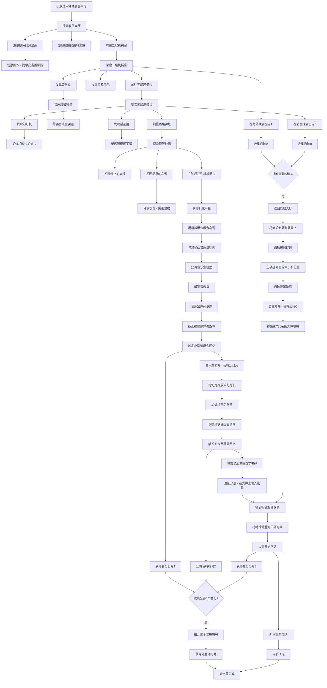

# 第一章谜题依赖图：乌鸦与钟楼

**章节主题**: 时间的循环与停滞  
**彩蛋融入**: 小刚演唱会 + 安吉百草园  
**最终产出**: 外层环符号  
**设计日期**: 2025-12-07  
**设计者**: 关卡与解谜设计 Manus

---

## 1. 章节概述

玩家作为"继承者"进入炼金术士的记忆世界,首先来到一座古老的钟楼。这座钟楼象征着时间的停滞——大钟已经停止摆动,乌鸦在楼顶盘旋,整个空间陷入了永恒的黄昏时刻。玩家需要修复钟楼的机械装置,让时间重新流动,并在这个过程中发现两段重要的回忆碎片。

### 场景设定

**钟楼共有四层**:
- **底层大厅**: 入口区域,有一个被锁住的齿轮装置和一幅褪色的风景画
- **二层机械室**: 钟楼的核心机械区域,有复杂的齿轮系统和一个音乐盒
- **三层观景台**: 可以看到外面的风景,有一个幻灯机和一个望远镜
- **顶层钟塔**: 大钟和乌鸦栖息的地方,有一个钟表谜题

### 叙事线索

- **主线**: 修复停滞的时间,让大钟重新摆动
- **支线A (小刚演唱会)**: 通过音乐盒谜题,回忆起一场充满激情的演唱会
- **支线B (安吉百草园)**: 通过幻灯机谜题,回忆起在植物园的宁静时光

---

## 2. 核心谜题依赖图



---

## 3. 谜题详细说明

### 3.1 齿轮拖放谜题 (Gear Drag-and-Drop Puzzle)

**位置**: 底层大厅的齿轮装置  
**前置条件**: 获得齿轮A和齿轮B  
**谜题类型**: 拖放 (Drag and Drop)

**谜题描述**:
玩家需要将两个不同大小的齿轮拖放到装置上的正确轴位上。装置上有三个轴,分别标记为小、中、大。齿轮A是小齿轮,应放在小轴上;齿轮B是中齿轮,应放在中轴上。正确放置后,装置会自动运转,打开一个隐藏的抽屉,里面有齿轮C(大齿轮)。

**交互设计**:
- 从背包拖动齿轮到装置上的轴位
- 如果放置错误,齿轮会弹回背包
- 正确放置时,齿轮会卡入轴位并开始缓慢旋转
- 所有齿轮正确放置后,播放机械运转音效,抽屉弹出

**视觉反馈**:
- 正确的轴位会在齿轮靠近时发光
- 错误的轴位会显示红色警告
- 装置运转时,所有齿轮联动旋转

**技术实现**: 使用`APuzzle_DragAndDrop`基类

---

### 3.2 音乐盒序列谜题 (Music Box Sequence Puzzle)

**位置**: 二层机械室  
**前置条件**: 用音乐盒钥匙解锁音乐盒  
**谜题类型**: 序列输入 (Sequence Input)

**谜题描述**:
音乐盒上有7个音符按钮(Do Re Mi Fa Sol La Si),玩家需要按照正确的顺序弹奏一段旋律。这段旋律是小刚演唱会上的一首经典歌曲的副歌部分。线索隐藏在二层机械室的墙上,有一幅褪色的乐谱。

**正确序列**: Mi - Sol - Mi - Do - Re - Mi - Re - Do  
**线索来源**: 墙上的乐谱(需要用望远镜从三层观察二层墙壁才能看清)

**交互设计**:
- 点击音符按钮,播放对应音符
- 每次点击记录在序列中
- 如果序列错误,音乐盒会发出不和谐音并重置
- 正确完成序列后,音乐盒播放完整旋律

**视觉反馈**:
- 点击的音符按钮会短暂发光
- 正确序列完成后,音乐盒打开,内部有幻灯片
- 触发小刚演唱会回忆的过场动画

**奖励**:
- 音符符号1
- 幻灯片(用于幻灯机谜题)

**技术实现**: 使用`APuzzle_SequenceInput`基类

---

### 3.3 幻灯机焦距谜题 (Projector Focus Puzzle)

**位置**: 三层观景台  
**前置条件**: 获得幻灯片并放入幻灯机  
**谜题类型**: 滑块调整 (Slider) & 物品使用

**谜题描述**:
玩家将幻灯片放入幻灯机后,投影出现在对面的墙上,但画面模糊不清。玩家需要通过调整焦距滑块,使画面变得清晰。清晰的画面显示的是安吉百草园的一处风景,以及一个三位数字密码:「147」。

**交互设计**:
- 从背包拖动幻灯片到幻灯机
- 幻灯机自动打开,显示模糊的投影
- 点击幻灯机,出现焦距调整UI
- 拖动滑块,实时调整投影的清晰度
- 当滑块到达正确位置(约75%),画面完全清晰

**视觉反馈**:
- 滑块调整时,投影的模糊程度实时变化
- 正确焦距时,画面锁定并高亮显示密码
- 触发安吉百草园回忆的过场动画

**奖励**:
- 音符符号2
- 三位数字密码:147(用于钟表谜题)

**技术实现**: 结合物品使用交互和UMG滑块控件,滑块值与后期处理模糊效果绑定

---

### 3.4 钟表指针旋转谜题 (Clock Rotation Puzzle)

**位置**: 顶层钟塔  
**前置条件**: 获得三位数字密码(147)和齿轮C  
**谜题类型**: 旋转 (Rotate) & 密码输入

**谜题描述**:
大钟有三个指针:时针、分针、秒针。玩家需要先将齿轮C安装到大钟的机械装置中,然后通过旋转指针,将时间调整到密码所指示的时间:1点47分0秒。正确设置后,大钟开始摆动,时间重新流动。

**交互设计**:
- 从背包拖动齿轮C到大钟背面的机械装置
- 安装齿轮后,大钟的指针变为可交互状态
- 点击并拖动指针,根据鼠标移动旋转
- 三个指针需要分别调整到正确位置
- 时间正确后,大钟自动锁定并开始摆动

**视觉反馈**:
- 指针被选中时高亮显示
- 拖动时显示当前时间
- 正确时间设置后,大钟发出洪亮的钟声
- 整个钟楼开始轻微震动

**奖励**:
- 音符符号3
- 时间重新流动,乌鸦飞走

**技术实现**: 使用`APuzzle_Rotatable`基类,根据鼠标/触摸移动计算旋转角度

---

### 3.5 乌鸦喂食交互 (Crow Feeding Interaction)

**位置**: 顶层钟塔  
**前置条件**: 获得机械甲虫  
**谜题类型**: 物品使用

**谜题描述**:
顶层有一只栖息的乌鸦,它守护着音乐盒钥匙。玩家需要用机械甲虫喂食乌鸦,乌鸦吃掉甲虫后会掉落钥匙。

**交互设计**:
- 点击乌鸦,显示"乌鸦看起来很饥饿"的提示
- 从背包拖动机械甲虫到乌鸦
- 乌鸦啄食甲虫的动画
- 乌鸦满足后,掉落音乐盒钥匙

**视觉反馈**:
- 乌鸦的眼睛会跟随玩家的鼠标
- 喂食时播放乌鸦叫声
- 钥匙掉落在地上,发出金属碰撞声

**技术实现**: 标准物品使用交互,实现`IInteractable`接口的`OnUseItem`函数

---

## 4. 物品清单

| 物品ID | 物品名称 | 获取方式 | 用途 | 图标描述 |
|--------|---------|---------|------|---------|
| `Gear_A` | 小齿轮 | 二层机械室角落 | 齿轮拖放谜题 | 黄铜小齿轮 |
| `Gear_B` | 中齿轮 | 三层观景台窗台 | 齿轮拖放谜题 | 黄铜中齿轮 |
| `Gear_C` | 大齿轮 | 齿轮装置打开后获得 | 钟表谜题 | 黄铜大齿轮 |
| `MechanicalBeetle` | 机械甲虫 | 顶层钟塔大钟后面 | 喂食乌鸦 | 精致的黄铜甲虫 |
| `MusicBoxKey` | 音乐盒钥匙 | 乌鸦掉落 | 解锁音乐盒 | 小巧的银色钥匙 |
| `Slide` | 幻灯片 | 音乐盒打开后获得 | 幻灯机谜题 | 玻璃幻灯片 |
| `CrowFeather` | 乌鸦羽毛 | 二层机械室地板 | 观察物品(无实际用途) | 黑色羽毛 |
| `Note_1` | 音符符号1 | 完成音乐盒谜题 | 组合成外层环符号 | 音符形状的符号 |
| `Note_2` | 音符符号2 | 完成幻灯机谜题 | 组合成外层环符号 | 音符形状的符号 |
| `Note_3` | 音符符号3 | 完成钟表谜题 | 组合成外层环符号 | 音符形状的符号 |
| `OuterRingSymbol` | 外层环符号 | 组合三个音符符号 | 第一章最终产出 | 复杂的炼金术符号 |

---

## 5. 场景布局概述

### 底层大厅
```
┌─────────────────────────────────────┐
│                                     │
│    [褪色的风景画]                    │
│                                     │
│                                     │
│         [齿轮装置]                   │
│          (锁住)                      │
│                                     │
│                                     │
│  [楼梯↑]                             │
│                                     │
│            [入口]                    │
└─────────────────────────────────────┘
```

### 二层机械室
```
┌─────────────────────────────────────┐
│  [齿轮A]                   [楼梯↑]  │
│   (角落)                            │
│                                     │
│      [音乐盒]        [墙上乐谱]      │
│      (锁住)          (褪色)         │
│                                     │
│  [乌鸦羽毛]                          │
│   (地板)                            │
│                                     │
│  [楼梯↓]                             │
└─────────────────────────────────────┘
```

### 三层观景台
```
┌─────────────────────────────────────┐
│  [楼梯↑]                             │
│                                     │
│  [幻灯机]          [望远镜]          │
│                                     │
│                    [齿轮B]          │
│                    (窗台)           │
│                                     │
│  [投影墙]                            │
│                                     │
│  [楼梯↓]                             │
└─────────────────────────────────────┘
```

### 顶层钟塔
```
┌─────────────────────────────────────┐
│                                     │
│          [乌鸦]                      │
│        (栖息中)                      │
│                                     │
│         [大钟]                       │
│      (停止摆动)                      │
│                                     │
│    [机械甲虫]                        │
│    (钟后隐藏)                        │
│                                     │
│  [楼梯↓]                             │
└─────────────────────────────────────┘
```

---

## 6. 关键事件序列

1. **开场**: 玩家进入钟楼,听到主角独白:"时间在这里停止了...我能感受到它的沉默。"
2. **探索阶段**: 玩家自由探索四层楼,收集齿轮A、B和机械甲虫
3. **乌鸦喂食**: 用机械甲虫喂食乌鸦,获得音乐盒钥匙
4. **音乐盒谜题**: 解锁并完成音乐盒谜题,触发小刚演唱会回忆
5. **幻灯机谜题**: 完成幻灯机谜题,触发安吉百草园回忆,获得密码
6. **齿轮装置**: 完成齿轮拖放谜题,获得齿轮C
7. **钟表谜题**: 完成钟表谜题,大钟开始摆动
8. **结局**: 收集全部三个音符符号,组合成外层环符号,乌鸦飞走,时间重新流动

---

## 7. 难度平衡

- **简单谜题** (引导性): 齿轮收集、乌鸦喂食
- **中等谜题** (需要观察): 齿轮拖放、幻灯机焦距
- **困难谜题** (需要线索): 音乐盒序列、钟表旋转

**提示系统建议**:
- 提示1: "仔细观察墙上的乐谱..."
- 提示2: "幻灯片的画面似乎隐藏着什么..."
- 提示3: "时间的秘密藏在数字中..."

---

## 8. 叙事整合

### 小刚演唱会回忆 (音乐盒谜题)
完成音乐盒谜题后,触发一段过场动画:
- 画面切换到演唱会现场
- 人群的欢呼声
- 舞台上的灯光
- 主角独白:"那个夜晚,音乐让时间凝固..."

### 安吉百草园回忆 (幻灯机谜题)
完成幻灯机谜题后,触发一段过场动画:
- 画面切换到植物园
- 阳光透过树叶
- 宁静的小径
- 主角独白:"在那片绿意中,我们找到了片刻的永恒..."

### 时间重启 (钟表谜题)
完成钟表谜题后:
- 大钟发出洪亮的钟声
- 整个钟楼震动
- 乌鸦飞向天空
- 主角独白:"时间再次流动,但那些记忆已被永远铭刻..."

---

## 9. 技术实现要点

### 需要的C++基类
- `APuzzle_DragAndDrop`: 齿轮拖放谜题
- `APuzzle_SequenceInput`: 音乐盒序列谜题
- `APuzzle_Rotatable`: 钟表旋转谜题
- `IInteractable`: 所有可交互对象的接口

### 需要的数据表
- `DT_Items_Chapter1.csv`: 所有物品数据
- `DT_Dialogue_Chapter1.csv`: 所有对话和独白文本
- `DT_PuzzleHints_Chapter1.csv`: 提示系统数据

### 需要的美术资源
- 钟楼四层场景背景
- 齿轮装置模型
- 音乐盒模型和UI
- 幻灯机模型和投影效果
- 大钟模型和指针
- 乌鸦角色模型和动画
- 所有物品的图标和3D模型

### 需要的音效
- 齿轮转动音效
- 音乐盒旋律
- 幻灯机运转音效
- 大钟钟声
- 乌鸦叫声
- 背景环境音效

---

## 10. 下一步工作

1. **场景布局细化**: 在`Docs/LevelLayouts/`目录下创建更详细的场景布局图
2. **数据表填充**: 创建并填充`DT_Items_Chapter1.csv`和`DT_Dialogue_Chapter1.csv`
3. **交互细节文档**: 在`Docs/`下创建`PUZZLE_DETAILS_Chapter1.md`,详细描述每个谜题的实现逻辑
4. **美术需求清单**: 为美术Manus准备详细的资源需求列表
5. **音效需求清单**: 为音效制作准备详细的音效需求列表

---

**设计理念**: 本章的谜题设计遵循锈湖系列的经典风格——通过碎片化的线索和非线性的探索,让玩家逐步拼凑出完整的故事。每个谜题都与"时间"这一主题紧密相关,同时自然地融入了两段个人回忆,使游戏体验既有挑战性又充满情感共鸣。
