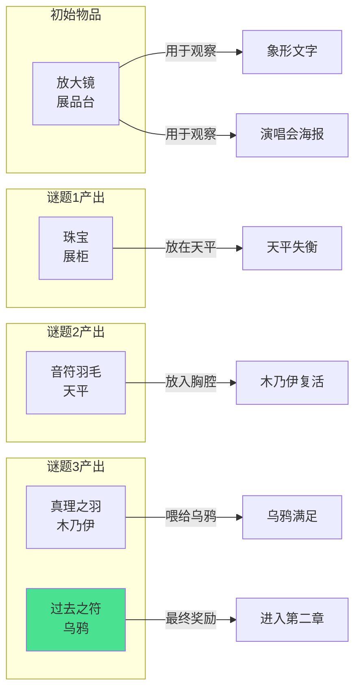

# 第一章谜题依赖图：珠宝、埃及与音乐（博物馆版）

**章节主题**: 凝固的美丽与永生的诅咒  
**彩蛋融入**: 卡地亚珠宝展 + 埃及展 + 小刚演唱会  
**最终产出**: 过去之符（羽毛形状）  
**设计日期**: 2025-12-07（优化版）  
**设计者**: 关卡与解谜设计 Manus

---

## 📖 阅读指南

本文档提供第一章的完整谜题逻辑流程图，包括：
- **主线流程**：必须完成的谜题
- **可选内容**：增强体验的额外交互
- **物品流转**：物品的获取和使用关系
- **事件触发**：关键事件的触发条件

---

## 1. 核心设计理念

### 1.1 主题表达

> **"珠宝凝固了美丽，木乃伊追求永生，但只有音乐，让时间在流动中停止。"**

这一章通过三个层次表达主题：

| 层次 | 元素 | 象征意义 | 玩家体验 |
|------|------|---------|---------|
| **第一层** | 卡地亚珠宝 | 凝固的美丽 | 聆听珠宝的诅咒 |
| **第二层** | 埃及天平 | 永生的代价 | 理解轻盈的真理 |
| **第三层** | 音乐盒 | 流动的永恒 | 重温美好的瞬间 |

### 1.2 谜题哲学

- **简洁性**：3个核心谜题，流程清晰
- **情感性**：每个谜题都有情感共鸣点
- **象征性**：物品和交互都有深层隐喻
- **流畅性**：减少卡关，增强引导

---

## 2. 完整谜题依赖图

```mermaid
graph TD
    Start[玩家进入博物馆第一展厅] --> Opening[开场独白<br/>炼金术士的自我质疑]
    
    Opening --> Explore[自由探索展厅]
    
    %% 探索阶段 - 发现关键物品和线索
    Explore --> FindJewels[发现卡地亚展柜<br/>三件珠宝:戒指/项链/王冠]
    Explore --> FindScale[发现埃及天平<br/>右侧有真理之羽]
    Explore --> FindSarcophagus[发现埃及石棺<br/>封闭的,有象形文字]
    Explore --> FindMusicBox[发现音乐盒<br/>锁住的,刻着"2024"]
    Explore --> FindCrow[发现乌鸦<br/>栖息在横梁上]
    Explore --> FindMagnifier[拾取放大镜<br/>展品台上的工具]
    Explore --> FindDiary[发现炼金术士日记<br/>展品台上]
    Explore --> FindPoster[发现演唱会海报<br/>墙上,模糊的]
    
    %% 谜题1: 珠宝的低语与天平的审判
    FindJewels --> ClickJewels[点击卡地亚展柜]
    ClickJewels --> JewelGlow[展柜发光<br/>三件珠宝依次闪烁]
    
    JewelGlow --> RingWhisper[戒指低语<br/>承诺的诅咒]
    RingWhisper --> RingFrost[戒指周围出现冰霜]
    
    RingFrost --> NecklaceWhisper[项链低语<br/>拥抱的囚禁]
    NecklaceWhisper --> NecklaceChain[项链周围出现锁链]
    
    NecklaceChain --> CrownWhisper[王冠低语<br/>美丽的枷锁]
    CrownWhisper --> CrownShackle[王冠周围出现枷锁]
    
    CrownShackle --> CaseOpen[展柜自动打开]
    CaseOpen --> GetJewel[拾取一件珠宝<br/>任意选择]
    
    %% 埃及部分
    FindSarcophagus --> ObserveSarcophagus[观察石棺<br/>看到象形文字]
    FindMagnifier --> HaveMagnifier{拥有放大镜?}
    ObserveSarcophagus --> HaveMagnifier
    
    HaveMagnifier -->|是| UseMagnifier[用放大镜观察象形文字]
    UseMagnifier --> TranslateText[文字翻译显示<br/>心脏与羽毛的审判]
    
    FindScale --> ObserveScale[观察天平<br/>羽毛在右侧]
    TranslateText --> ObserveScale
    
    GetJewel --> TryJewelOnScale[将珠宝放在天平左侧]
    ObserveScale --> TryJewelOnScale
    
    TryJewelOnScale --> ScaleImbalance[天平严重失衡<br/>珠宝太重]
    ScaleImbalance --> ScaleReject[天平拒绝珠宝<br/>珠宝返回背包]
    
    ScaleReject --> Monologue1[独白:珠宝太重<br/>真正的爱应该轻盈]
    
    %% 日记线索
    FindDiary --> ReadDiary[阅读日记]
    Monologue1 --> ReadDiary
    ReadDiary --> DiaryHint[日记提示:答案在音乐盒里<br/>"音乐盒"三字发光]
    
    %% 谜题2: 音乐盒的秘密
    FindMusicBox --> ObserveMusicBox[观察音乐盒<br/>3位数字密码锁]
    DiaryHint --> ObserveMusicBox
    
    FindPoster --> ObservePoster[观察海报<br/>模糊不清]
    HaveMagnifier -->|是| UseMagnifierOnPoster[用放大镜观察海报]
    ObservePoster --> UseMagnifierOnPoster
    
    UseMagnifierOnPoster --> SeeDate[看清日期:7月27日<br/>金色字体强调]
    SeeDate --> KnowPassword{知道密码?}
    
    ReadDiary --> DiaryDate[日记中提到<br/>"第7个月,第27天"]
    DiaryDate --> KnowPassword
    
    KnowPassword -->|是| EnterPassword[输入密码:727]
    EnterPassword --> PasswordCorrect{密码正确?}
    
    PasswordCorrect -->|错误| WrongPassword[密码锁震动<br/>嗡嗡声]
    WrongPassword --> EnterPassword
    
    PasswordCorrect -->|正确| UnlockMusicBox[音乐盒解锁<br/>咔嚓声]
    UnlockMusicBox --> MusicBoxOpen[盖子缓慢打开]
    
    MusicBoxOpen --> MusicBoxPlay[音乐盒旋律响起<br/>两个人偶跳舞]
    MusicBoxPlay --> NotesAppear[音符从盒中飞出<br/>变成实体]
    
    NotesAppear --> NotesFly[7个音符飞舞<br/>像蝴蝶一样]
    NotesFly --> NotesToScale[音符自动飞向天平]
    
    NotesToScale --> NotesFall[音符依次落在天平左侧<br/>每个发出对应音高]
    NotesFall --> ScaleBalance[天平逐渐平衡]
    
    ScaleBalance --> LastNote[最后一个音符落下]
    LastNote --> ScalePerfectBalance[天平完全平衡<br/>金色光芒升起]
    
    %% 过场动画: 小刚演唱会回忆
    ScalePerfectBalance --> ConcertMemory[触发演唱会回忆<br/>过场动画]
    
    ConcertMemory --> ConcertScene1[场景1:舞台全景<br/>周传雄剪影]
    ConcertScene1 --> ConcertScene2[场景2:人群中的两人<br/>只有你们是清晰的]
    ConcertScene2 --> ConcertScene3[场景3:舞台异变<br/>周传雄变成巨大乌鸦]
    ConcertScene3 --> ConcertScene4[场景4:音符雪<br/>音符像雪花飘落]
    ConcertScene4 --> ConcertScene5[场景5:时间停滞<br/>只有两人在动]
    ConcertScene5 --> ConcertScene6[场景6:符号浮现<br/>过去之符原型]
    
    ConcertScene6 --> ReturnToHall[回到展厅<br/>淡入]
    
    ReturnToHall --> NoteFeatherAppear[天平上出现音符羽毛<br/>音符凝固成羽毛]
    
    %% 谜题3: 乌鸦的审判与符号获得
    NoteFeatherAppear --> GetNoteFeather[拾取音符羽毛<br/>半透明,发光]
    
    GetNoteFeather --> SarcophagusOpen[石棺自动打开<br/>轰隆声]
    SarcophagusOpen --> RevealMummy[露出木乃伊<br/>胸腔是空的]
    
    RevealMummy --> MummyNote[木乃伊手中有纸条]
    MummyNote --> ReadNote[阅读纸条<br/>将心脏放入胸腔]
    
    ReadNote --> ChestGlow[木乃伊胸腔发光<br/>提示玩家]
    ChestGlow --> PlaceNoteFeather[将音符羽毛放入胸腔]
    
    PlaceNoteFeather --> FeatherTransform[羽毛变成心脏<br/>由音符组成]
    FeatherTransform --> HeartBeat[心脏开始跳动<br/>咚咚声]
    
    HeartBeat --> MummyRevive[木乃伊复活<br/>眼睛睁开]
    MummyRevive --> MummySitUp[木乃伊坐起<br/>转头看向玩家]
    MummySitUp --> MummySpeak[木乃伊说话<br/>关于真正的永生]
    
    MummySpeak --> MummyGiveFeather[木乃伊递出真理之羽<br/>白色,发光]
    MummyGiveFeather --> GetTruthFeather[获得真理之羽]
    
    GetTruthFeather --> MummyRest[木乃伊躺回石棺<br/>石棺合上]
    
    %% 乌鸦交互
    FindCrow --> ObserveCrow[观察乌鸦<br/>眼神悲伤而智慧]
    MummyRest --> ObserveCrow
    
    ObserveCrow --> CrowLook[乌鸦看向天平/石棺/玩家<br/>眼神有期待]
    
    GetTruthFeather --> FeedCrow[将真理之羽喂给乌鸦]
    CrowLook --> FeedCrow
    
    FeedCrow --> CrowEat[乌鸦啄食羽毛<br/>羽毛发光消失]
    CrowEat --> CrowSatisfied[乌鸦满足鸣叫<br/>展开翅膀]
    
    CrowSatisfied --> CrowDropFeather[乌鸦掉落羽毛<br/>发光的羽毛飘落]
    CrowDropFeather --> FeatherToGround[羽毛落地]
    
    FeatherToGround --> PickupFeather[拾取羽毛]
    PickupFeather --> FeatherTransformSymbol[羽毛变形<br/>成为过去之符]
    
    FeatherTransformSymbol --> SymbolCloseup[符号特写<br/>复杂的纹路]
    SymbolCloseup --> GetPastSymbol[获得过去之符<br/>金色光芒]
    
    GetPastSymbol --> FinalMonologue[最终独白<br/>关于记忆的珍藏]
    
    %% 章节结束
    FinalMonologue --> DoorOpen[展厅门打开<br/>发出光芒]
    DoorOpen --> SeeNextHall[看到第二展厅<br/>绿色光芒]
    
    SeeNextHall --> EndingMonologue[结束独白<br/>爱的永恒]
    EndingMonologue --> ChapterEnd[第一章完成<br/>淡出]
    
    ChapterEnd --> Chapter2[进入第二章]
    
    %% 可选内容
    MusicBoxPlay -.->|可选| OptionalNoteSequence[音符序列谜题<br/>高级玩家挑战]
    OptionalNoteSequence -.-> OptionalReward[额外奖励<br/>特殊对话]
    
    style Start fill:#4a90e2
    style ChapterEnd fill:#4a90e2
    style ConcertMemory fill:#e24a4a
    style GetPastSymbol fill:#4ae290
    style OptionalNoteSequence fill:#e2e24a
```

---

## 3. 物品流转图



---

## 4. 关键事件触发条件

### 4.1 展柜打开
- **触发条件**: 三件珠宝都说完低语
- **前置条件**: 点击卡地亚展柜
- **结果**: 玩家可以拾取一件珠宝

### 4.2 音乐盒解锁
- **触发条件**: 输入正确密码 727
- **前置条件**: 
  - 观察音乐盒
  - 用放大镜看清海报日期
  - 阅读日记中的提示
- **结果**: 音乐盒打开，音符飞出

### 4.3 天平平衡
- **触发条件**: 7个音符全部落在天平左侧
- **前置条件**: 音乐盒打开
- **结果**: 触发演唱会回忆过场

### 4.4 石棺打开
- **触发条件**: 天平平衡
- **前置条件**: 完成演唱会回忆
- **结果**: 露出木乃伊，可以交互

### 4.5 木乃伊复活
- **触发条件**: 将音符羽毛放入胸腔
- **前置条件**: 
  - 石棺已打开
  - 拾取音符羽毛
- **结果**: 木乃伊给予真理之羽

### 4.6 乌鸦给予符号
- **触发条件**: 将真理之羽喂给乌鸦
- **前置条件**: 木乃伊给予真理之羽
- **结果**: 获得过去之符，章节完成

---

## 5. 谜题难度分析

### 5.1 难度曲线

```
难度
  ↑
5 │                    ╱╲
  │                   ╱  ╲
4 │         ╱╲       ╱    ╲
  │        ╱  ╲     ╱      ╲
3 │       ╱    ╲   ╱        ╲
  │      ╱      ╲ ╱          ╲
2 │     ╱        ╳            ╲
  │    ╱        ╱ ╲            ╲
1 │___╱________╱   ╲____________╲___
  └────────────────────────────────→
    开场 珠宝 天平 音乐盒 回忆 乌鸦 结束
```

### 5.2 难度评级

| 谜题 | 难度 | 原因 | 提示系统 |
|------|------|------|---------|
| 珠宝低语 | ★★☆☆☆ | 自动播放，无需操作 | 无需 |
| 天平审判 | ★★★☆☆ | 需要理解象征意义 | 日记提示 |
| 音乐盒密码 | ★★★★☆ | 需要找到多个线索 | 3级提示系统 |
| 木乃伊交互 | ★★☆☆☆ | 流程清晰，有视觉引导 | 胸腔发光提示 |
| 乌鸦喂食 | ★★☆☆☆ | 逻辑简单 | 乌鸦眼神提示 |

### 5.3 提示系统设计

**音乐盒密码提示**（3级）:

1. **第1级提示**（30秒后）:
   > "墙上的海报似乎隐藏着什么...也许需要仔细观察？"

2. **第2级提示**（60秒后）:
   > "日记中提到了一个特殊的日期...7月27日。"

3. **第3级提示**（90秒后）:
   > "密码是：727"

---

## 6. 时间线估算

### 6.1 首次通关时间线

| 阶段 | 预计时间 | 累计时间 |
|------|---------|---------|
| 开场探索 | 1-2分钟 | 2分钟 |
| 珠宝低语 | 2-3分钟 | 5分钟 |
| 天平交互 | 1-2分钟 | 7分钟 |
| 音乐盒谜题 | 3-4分钟 | 11分钟 |
| 演唱会回忆 | 1分钟 | 12分钟 |
| 木乃伊交互 | 1-2分钟 | 14分钟 |
| 乌鸦交互 | 1分钟 | 15分钟 |
| **总计** | **10-15分钟** | |

### 6.2 速通时间线

熟练玩家，知道所有谜题答案：**5-7分钟**

---

## 7. 可选内容设计

### 7.1 音符序列谜题（可选）

**触发条件**: 音乐盒打开后，点击音符按钮

**谜题设计**:
- 7个音符按钮：Do Re Mi Fa Sol La Si
- 正确序列：Mi-Sol-Mi-Do-Re-Mi-Re-Do
- 线索：留声机旁边有一张乐谱

**奖励**:
- 额外对话：炼金术士回忆演唱会的更多细节
- 视觉效果：音符飞舞更华丽
- 成就解锁："完美旋律"

**失败处理**:
- 不影响主线进度
- 可以跳过，直接触发音符飞出

### 7.2 环境交互（可选）

**留声机**:
- 点击可以播放古典音乐
- 纯粹的氛围营造

**吊灯**:
- 点击会微微摇晃
- 光影变化

**展品标签**:
- 每个展品都有详细的说明
- 增加世界观深度

---

## 8. 失败状态处理

### 8.1 无失败设计

本章采用**无失败设计**，玩家不会因为操作错误而卡关：

- **密码错误**: 可以无限次重试
- **物品使用错误**: 物品返回背包，可以重新尝试
- **可选谜题失败**: 不影响主线

### 8.2 引导系统

**视觉引导**:
- 可交互物品发出微光
- 关键物品在对话中被提及时，镜头短暂切向它们
- 胸腔发光提示放置位置

**音频引导**:
- 可交互物品有环境音效
- 正确操作有正向反馈音效
- 错误操作有温和的负向反馈

**文本引导**:
- 独白中包含隐性提示
- 日记中有明确线索
- 提示系统作为最后保障

---

## 9. 技术实现要点

### 9.1 状态机设计

**展厅状态**:
```
Idle → JewelsWhispering → ScaleTested → MusicBoxOpened → 
ConcertMemory → SarcophagusOpened → MummyRevived → 
CrowFed → SymbolObtained → ChapterComplete
```

### 9.2 事件系统

**关键事件**:
- `OnJewelsCaseOpened`
- `OnScaleBalanced`
- `OnMusicBoxUnlocked`
- `OnConcertMemoryComplete`
- `OnMummyRevived`
- `OnSymbolObtained`

### 9.3 保存点

**自动保存触发点**:
1. 进入展厅
2. 展柜打开
3. 音乐盒解锁
4. 演唱会回忆结束
5. 获得过去之符

---

## 10. 测试检查清单

### 10.1 功能测试

- [ ] 所有可交互物品都能正常点击
- [ ] 放大镜能正确使用在所有目标上
- [ ] 密码输入正确/错误都有反馈
- [ ] 物品能正确拖放到目标位置
- [ ] 所有动画正常播放
- [ ] 所有音效正常触发
- [ ] 对话文本正确显示
- [ ] 过场动画正常播放
- [ ] 章节正确结束并过渡到第二章

### 10.2 逻辑测试

- [ ] 谜题必须按正确顺序完成
- [ ] 跳过可选内容不影响主线
- [ ] 物品使用逻辑正确
- [ ] 事件触发条件正确
- [ ] 状态转换正确

### 10.3 体验测试

- [ ] 首次通关时间在10-15分钟
- [ ] 谜题难度适中，不会卡关
- [ ] 情感节奏流畅
- [ ] 视觉引导清晰
- [ ] 音频氛围营造到位

---

## 11. 后续优化方向

### 11.1 可能的扩展

1. **成就系统**
   - 完美旋律：完成音符序列谜题
   - 细心观察者：阅读所有展品标签
   - 速通大师：5分钟内完成章节

2. **收集要素**
   - 隐藏的记忆碎片
   - 炼金术士的草稿纸
   - 演唱会门票

3. **多结局**
   - 根据玩家选择的珠宝不同，独白略有差异
   - 不影响主线，仅增加重玩价值

### 11.2 性能优化

- 预加载过场动画资源
- 优化粒子效果
- 音频流式加载

---

## ✨ 总结

这个谜题依赖图设计了一个：
- **流程清晰**：3个核心谜题，逻辑简单
- **情感丰富**：每个谜题都有情感共鸣
- **引导充分**：视觉、音频、文本多重引导
- **无失败设计**：玩家不会卡关
- **符合预算**：10-15分钟游玩时间，5小时开发时间

玩家将在这一章中体验到：**珠宝的诅咒 → 天平的审判 → 音乐的永恒 → 记忆的珍藏**

这就是第一章的完整旅程。✨
