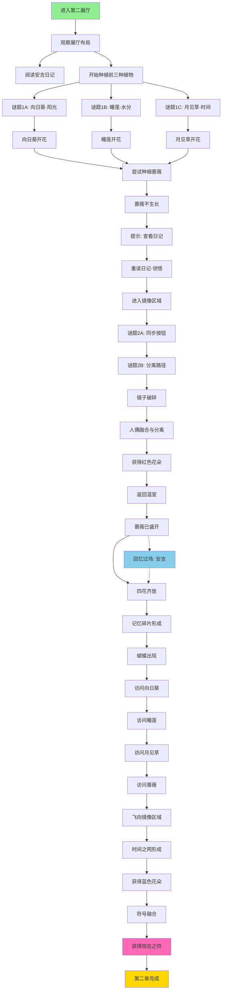
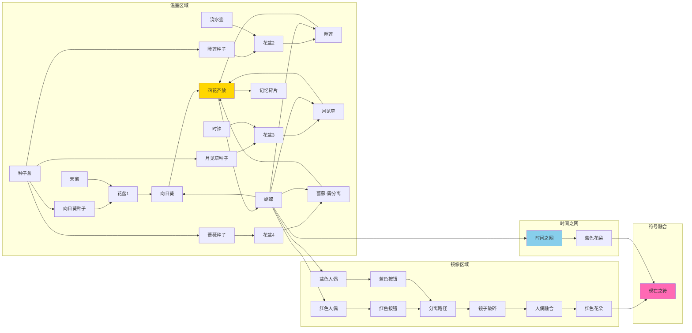

# 第二章谜题依赖图 - 博物馆版本

**章节**: 第二章 - 植物、镜像与成长  
**场景**: 博物馆第二展厅  
**符号**: 现在之符（两朵交织的花）  
**最后更新**: 2025-12-07

---

## 📊 谜题依赖总览图（Mermaid）

---

## 🔗 详细谜题依赖链

### 阶段1: 温室探索（0-3分钟）

**目标**: 理解展厅布局，开始种植前三种植物

| 步骤 | 操作 | 触发条件 | 结果 | 依赖 |
|------|------|---------|------|------|
| 1.1 | 进入第二展厅 | 完成第一章 | 开场独白 | - |
| 1.2 | 观察展厅 | 自动 | 镜头引导 | 1.1 |
| 1.3 | 观察种子盒 | 点击种子盒 | 显示4种种子 | 1.2 |
| 1.4 | 阅读安吉日记 | 点击日记 | 显示日记内容 | 1.2 |
| 1.5 | 开始种植 | 拿取种子 | 进入谜题1 | 1.3 |

**关键物品**:
- 种子盒（4种种子）
- 安吉日记（线索）
- 浇水壶
- 时钟

---

### 阶段2: 前三种植物（3-8分钟）

**目标**: 培育向日葵、睡莲、月见草

#### 谜题1A: 向日葵·阳光 ★★★☆☆

| 步骤 | 操作 | 触发条件 | 结果 | 依赖 |
|------|------|---------|------|------|
| 2.1 | 拿取金色种子 | 点击种子盒 | 获得向日葵种子 | 1.5 |
| 2.2 | 种植在花盆1 | 点击花盆1 | 种子种下 | 2.1 |
| 2.3 | 点击天窗开关 | 点击天窗 | 天窗打开 | 2.2 |
| 2.4 | 阳光照射 | 自动 | 向日葵生长动画 | 2.3 |
| 2.5 | 向日葵开花 | 动画结束 | 开花独白 | 2.4 |

**时长**: 1-2分钟  
**难度**: ★★★☆☆  
**音效**: 种植、天窗、生长、开花

---

#### 谜题1B: 睡莲·水分 ★★★☆☆

| 步骤 | 操作 | 触发条件 | 结果 | 依赖 |
|------|------|---------|------|------|
| 2.6 | 拿取蓝色种子 | 点击种子盒 | 获得睡莲种子 | 1.5 |
| 2.7 | 种植在花盆2 | 点击花盆2 | 种子种下 | 2.6 |
| 2.8 | 拾取浇水壶 | 点击浇水壶 | 获得浇水壶 | 2.7 |
| 2.9 | 浇水 | 点击花盆2 | 睡莲生长动画 | 2.8 |
| 2.10 | 睡莲开花 | 动画结束 | 开花独白 | 2.9 |

**时长**: 1-2分钟  
**难度**: ★★★☆☆  
**音效**: 种植、浇水、生长、开花

---

#### 谜题1C: 月见草·时间 ★★★★☆

| 步骤 | 操作 | 触发条件 | 结果 | 依赖 |
|------|------|---------|------|------|
| 2.11 | 拿取紫色种子 | 点击种子盒 | 获得月见草种子 | 1.5 |
| 2.12 | 种植在花盆3 | 点击花盆3 | 种子种下 | 2.11 |
| 2.13 | 点击时钟 | 点击时钟 | 时钟界面打开 | 2.12 |
| 2.14 | 调整时间 | 拖动指针 | 时间流逝动画 | 2.13 |
| 2.15 | 月见草生长 | 时间到夜晚 | 生长动画 | 2.14 |
| 2.16 | 月见草开花 | 动画结束 | 开花独白 | 2.15 |

**时长**: 2-3分钟  
**难度**: ★★★★☆（需要理解时间机制）  
**音效**: 种植、时钟滴答、生长、开花

---

### 阶段3: 蔷薇的秘密（8-10分钟）

**目标**: 发现蔷薇需要"分离"才能生长

#### 谜题1D: 蔷薇·独立 ★★★★★

| 步骤 | 操作 | 触发条件 | 结果 | 依赖 |
|------|------|---------|------|------|
| 3.1 | 拿取粉红种子 | 点击种子盒 | 获得蔷薇种子 | 前三种植物开花 |
| 3.2 | 种植在花盆4 | 点击花盆4 | 种子种下 | 3.1 |
| 3.3 | 尝试阳光 | 打开天窗 | 无效 | 3.2 |
| 3.4 | 尝试浇水 | 浇水 | 无效 | 3.2 |
| 3.5 | 尝试时间 | 调整时钟 | 无效 | 3.2 |
| 3.6 | 等待30秒 | 自动 | 提示出现 | 3.5 |
| 3.7 | 重读日记 | 点击日记 | 关键词发光 | 3.6 |
| 3.8 | 领悟 | 阅读完成 | 领悟独白 | 3.7 |
| 3.9 | 进入镜像区域 | 走向镜像 | 转场 | 3.8 |

**时长**: 2-3分钟  
**难度**: ★★★★★（需要打破常规思维）  
**关键设计**: 蔷薇不会立即生长，需要玩家"离开"

---

### 阶段4: 镜像谜题（10-13分钟）

**目标**: 完成双人成形的镜像挑战

#### 谜题2A: 同步按钮 ★★★☆☆

| 步骤 | 操作 | 触发条件 | 结果 | 依赖 |
|------|------|---------|------|------|
| 4.1 | 观察镜子 | 进入镜像区域 | 镜像独白 | 3.9 |
| 4.2 | 阅读碑文 | 点击碑文 | 显示碑文内容 | 4.1 |
| 4.3 | 点击红色人偶 | 点击人偶 | 人偶移动到按钮 | 4.2 |
| 4.4 | 蓝色人偶镜像 | 自动 | 同步移动 | 4.3 |
| 4.5 | 按钮同时按下 | 自动 | 镜子裂缝发光 | 4.4 |
| 4.6 | 完成机关1 | 自动 | 同步独白 | 4.5 |

**时长**: 1-2分钟  
**难度**: ★★★☆☆  
**核心机制**: 镜像同步

---

#### 谜题2B: 分离路径 ★★★★☆

| 步骤 | 操作 | 触发条件 | 结果 | 依赖 |
|------|------|---------|------|------|
| 4.7 | 观察路径 | 完成机关1 | 路径显现 | 4.6 |
| 4.8 | 点击红色人偶 | 点击人偶 | 人偶沿上路前进 | 4.7 |
| 4.9 | 蓝色人偶镜像 | 自动 | 人偶沿下路前进 | 4.8 |
| 4.10 | 到达终点 | 自动 | 心形平台发光 | 4.9 |
| 4.11 | 完成机关2 | 自动 | 分离独白 | 4.10 |

**时长**: 1-2分钟  
**难度**: ★★★★☆  
**核心机制**: 分离但目标相同

---

#### 镜子破碎与融合 ★★★★★

| 步骤 | 操作 | 触发条件 | 结果 | 依赖 |
|------|------|---------|------|------|
| 4.12 | 镜子震动 | 完成机关2 | 震动动画 | 4.11 |
| 4.13 | 镜子破碎 | 自动 | 破碎动画 | 4.12 |
| 4.14 | 人偶走出 | 自动 | 人偶相遇 | 4.13 |
| 4.15 | 人偶拥抱 | 自动 | 拥抱动画 | 4.14 |
| 4.16 | 融合成紫色 | 自动 | 融合动画 | 4.15 |
| 4.17 | 分离成两个 | 自动 | 手牵手 | 4.16 |
| 4.18 | 融合独白 | 自动 | 独白播放 | 4.17 |
| 4.19 | 红色花朵出现 | 自动 | 获得红花 | 4.18 |

**时长**: 1分钟（自动播放）  
**难度**: ★★★★★（情感冲击）  
**核心体验**: 融合与分离的诗意

---

### 阶段5: 蔷薇盛开（13-14分钟）

**目标**: 返回温室，发现蔷薇已开花

| 步骤 | 操作 | 触发条件 | 结果 | 依赖 |
|------|------|---------|------|------|
| 5.1 | 返回温室 | 走回温室 | 镜头切换 | 4.19 |
| 5.2 | 蔷薇盛开 | 自动 | 蔷薇已开花 | 5.1 |
| 5.3 | 触发回忆 | 自动 | 安吉回忆过场 | 5.2 |
| 5.4 | 回忆结束 | 自动 | 回到温室 | 5.3 |
| 5.5 | 蔷薇独白 | 自动 | 独白播放 | 5.4 |

**时长**: 1分钟  
**回忆过场**: 20秒

---

### 阶段6: 四花齐放（14-15分钟）

**目标**: 四种植物都开花，形成记忆碎片

| 步骤 | 操作 | 触发条件 | 结果 | 依赖 |
|------|------|---------|------|------|
| 6.1 | 四朵花发光 | 蔷薇开花 | 同时发光 | 5.5 |
| 6.2 | 花瓣飘落 | 自动 | 粒子效果 | 6.1 |
| 6.3 | 花瓣融合 | 自动 | 形成水晶 | 6.2 |
| 6.4 | 记忆碎片 | 自动 | 水晶落在桌上 | 6.3 |
| 6.5 | 四花独白 | 自动 | 独白播放 | 6.4 |

**时长**: 30秒  
**视觉高潮**: 花瓣飘落+融合

---

### 阶段7: 蝴蝶的时间之网（15-17分钟）

**目标**: 蝴蝶连接四朵花和人偶，形成时间之网

#### 谜题3: 时间之网 ★★★☆☆

| 步骤 | 操作 | 触发条件 | 结果 | 依赖 |
|------|------|---------|------|------|
| 7.1 | 蝴蝶出现 | 四花齐放 | 蝴蝶飞出 | 6.5 |
| 7.2 | 访问向日葵 | 自动 | 显示日期 | 7.1 |
| 7.3 | 访问睡莲 | 自动 | 显示日期 | 7.2 |
| 7.4 | 访问月见草 | 自动 | 显示日期 | 7.3 |
| 7.5 | 访问蔷薇 | 自动 | 显示日期 | 7.4 |
| 7.6 | 飞向镜像 | 自动 | 停在人偶手上 | 7.5 |
| 7.7 | 时间之网形成 | 自动 | 光线网络 | 7.6 |
| 7.8 | 蓝色花朵出现 | 自动 | 获得蓝花 | 7.7 |
| 7.9 | 时间独白 | 自动 | 独白播放 | 7.8 |

**时长**: 2分钟  
**难度**: ★★★☆☆（自动播放）  
**核心体验**: 时间的连接

---

### 阶段8: 符号融合（17-18分钟）

**目标**: 红蓝花朵融合，获得现在之符

| 步骤 | 操作 | 触发条件 | 结果 | 依赖 |
|------|------|---------|------|------|
| 8.1 | 两朵花飞向中央 | 蓝花出现 | 飞行动画 | 7.9 |
| 8.2 | 花朵旋转交织 | 自动 | 旋转动画 | 8.1 |
| 8.3 | 融合成符号 | 自动 | 现在之符形成 | 8.2 |
| 8.4 | 符号发光 | 自动 | 金色光芒 | 8.3 |
| 8.5 | 符号独白 | 自动 | 独白播放 | 8.4 |
| 8.6 | 获得现在之符 | 自动 | 符号进入背包 | 8.5 |

**时长**: 1分钟  
**情感高潮**: 符号融合

---

### 阶段9: 章节结束（18分钟）

**目标**: 完成第二章，开启第三展厅

| 步骤 | 操作 | 触发条件 | 结果 | 依赖 |
|------|------|---------|------|------|
| 9.1 | 门发光 | 获得符号 | 门打开 | 8.6 |
| 9.2 | 结束独白 | 自动 | 独白播放 | 9.1 |
| 9.3 | 章节完成 | 自动 | 显示标题 | 9.2 |
| 9.4 | 转场 | 自动 | 淡出 | 9.3 |

**时长**: 30秒

---

## 📈 物品流转图

---

## 🎯 关键事件触发表

| 事件ID | 事件名称 | 触发条件 | 结果 | 优先级 |
|--------|---------|---------|------|--------|
| E2_01 | 进入第二展厅 | 完成第一章 | 开场独白 | 高 |
| E2_02 | 向日葵开花 | 阳光照射 | 开花独白 | 中 |
| E2_03 | 睡莲开花 | 浇水 | 开花独白 | 中 |
| E2_04 | 月见草开花 | 时间到夜晚 | 开花独白 | 中 |
| E2_05 | 蔷薇提示 | 尝试失败30秒后 | 提示独白 | 高 |
| E2_06 | 进入镜像区域 | 领悟后 | 转场 | 高 |
| E2_07 | 同步按钮完成 | 两按钮同时按下 | 同步独白 | 中 |
| E2_08 | 分离路径完成 | 人偶到达终点 | 分离独白 | 中 |
| E2_09 | 镜子破碎 | 完成所有机关 | 破碎动画 | 高 |
| E2_10 | 人偶融合 | 镜子破碎后 | 融合动画+独白 | 高 |
| E2_11 | 获得红色花朵 | 融合后 | 红花进入背包 | 高 |
| E2_12 | 蔷薇盛开 | 返回温室 | 安吉回忆 | 高 |
| E2_13 | 四花齐放 | 蔷薇开花 | 花瓣飘落 | 高 |
| E2_14 | 蝴蝶出现 | 四花齐放 | 蝴蝶飞出 | 高 |
| E2_15 | 时间之网形成 | 蝴蝶访问完成 | 蓝花出现 | 高 |
| E2_16 | 符号融合 | 红蓝花都获得 | 现在之符形成 | 高 |
| E2_17 | 章节完成 | 获得现在之符 | 门打开 | 高 |

---

## ⏱️ 时间线估算

### 理想流程（12分钟）

| 时间段 | 阶段 | 主要活动 |
|--------|------|---------|
| 0:00-0:30 | 开场 | 进入展厅，观察布局 |
| 0:30-2:00 | 温室1 | 向日葵种植 |
| 2:00-3:30 | 温室2 | 睡莲种植 |
| 3:30-5:00 | 温室3 | 月见草种植 |
| 5:00-6:30 | 蔷薇 | 尝试种植，发现秘密 |
| 6:30-8:00 | 镜像1 | 同步按钮 |
| 8:00-9:30 | 镜像2 | 分离路径 |
| 9:30-10:30 | 镜像3 | 镜子破碎，获得红花 |
| 10:30-11:00 | 回温室 | 蔷薇盛开，安吉回忆 |
| 11:00-11:30 | 四花齐放 | 花瓣飘落，记忆碎片 |
| 11:30-13:00 | 时间之网 | 蝴蝶连接，蓝花出现 |
| 13:00-14:00 | 符号融合 | 现在之符形成 |
| 14:00-14:30 | 结束 | 门打开，转场 |

### 休闲流程（15分钟）

包含更多探索、重复阅读日记、欣赏动画等。

### 速通流程（10分钟）

熟悉流程，跳过所有可选对话。

---

## 🎮 难度分析

### 各谜题难度评级

| 谜题 | 难度 | 卡点可能性 | 提示需求 |
|------|------|-----------|---------|
| 向日葵·阳光 | ★★★☆☆ | 低 | 视觉引导 |
| 睡莲·水分 | ★★★☆☆ | 低 | 道具提示 |
| 月见草·时间 | ★★★★☆ | 中 | 时钟交互 |
| 蔷薇·独立 | ★★★★★ | 高 | 30秒提示 |
| 同步按钮 | ★★★☆☆ | 低 | 碑文引导 |
| 分离路径 | ★★★★☆ | 中 | 视觉引导 |
| 时间之网 | ★★★☆☆ | 低 | 自动播放 |

### 卡点预防

**蔷薇谜题**（最可能卡点）:
- 30秒后自动提示
- 日记关键词发光
- 镜头短暂切向镜像区域

**月见草谜题**:
- 时钟交互有明显视觉反馈
- 拖动指针时显示时间变化

**镜像谜题**:
- 碑文清晰说明机制
- 人偶移动有明显轨迹

---

## 🎨 视觉反馈设计

### 状态指示

| 对象 | 状态 | 视觉反馈 |
|------|------|---------|
| 花盆 | 空 | 灰色 |
| 花盆 | 有种子 | 微微发光 |
| 花盆 | 生长中 | 动画播放 |
| 花盆 | 已开花 | 持续发光 |
| 天窗 | 关闭 | 暗色 |
| 天窗 | 打开 | 阳光射入 |
| 时钟 | 可交互 | 指针闪烁 |
| 时钟 | 调整中 | 指针旋转 |
| 镜子 | 完整 | 反射 |
| 镜子 | 裂缝发光 | 金色光芒 |
| 镜子 | 破碎 | 粒子效果 |
| 人偶 | 可移动 | 轮廓发光 |
| 人偶 | 移动中 | 光迹 |
| 蝴蝶 | 飞行 | 翅膀扇动 |
| 蝴蝶 | 停留 | 翅膀缓慢开合 |

---

## 🔊 音效触发表

| 音效 | 触发事件 | 音量 | 时长 |
|------|---------|------|------|
| SFX_Plant_Seed | 种植种子 | 中 | 0.5秒 |
| SFX_Skylight_Open | 天窗打开 | 中 | 1秒 |
| SFX_Watering | 浇水 | 中 | 1.5秒 |
| SFX_Clock_Tick | 时钟调整 | 中 | 循环 |
| SFX_Plant_Grow | 植物生长 | 中 | 3秒 |
| SFX_Flower_Bloom | 花朵绽放 | 高 | 1秒 |
| SFX_Button_Press | 按钮按下 | 中 | 0.5秒 |
| SFX_Mirror_Crack | 镜子破裂 | 高 | 2秒 |
| SFX_Fusion | 融合 | 高 | 2秒 |
| SFX_Butterfly_Fly | 蝴蝶飞行 | 低 | 循环 |
| SFX_Symbol_Get | 符号获得 | 高 | 3秒 |
| BGM_Hall2_Main | 背景音乐 | 低 | 循环 |
| MUS_Anji_Memory | 安吉回忆 | 中 | 20秒 |

---

## ✅ 测试检查清单

### 功能测试

- [ ] 所有4种植物都能正常种植和生长
- [ ] 蔷薇在完成镜像谜题前不会生长
- [ ] 蔷薇在完成镜像谜题后自动盛开
- [ ] 天窗、浇水壶、时钟交互正常
- [ ] 镜像人偶移动正确（镜像同步）
- [ ] 镜子破碎动画正常触发
- [ ] 人偶融合与分离动画正常
- [ ] 蝴蝶自动访问4朵花
- [ ] 时间之网正确形成
- [ ] 红蓝花朵正确融合成现在之符
- [ ] 安吉回忆过场正常播放
- [ ] 章节结束门正确打开

### 音频测试

- [ ] 所有音效正确播放
- [ ] 背景音乐循环正常
- [ ] 安吉回忆音乐正确触发
- [ ] 音效音量平衡合理
- [ ] 独白语音清晰（如有）

### 视觉测试

- [ ] 植物生长动画流畅
- [ ] 花瓣飘落粒子效果正常
- [ ] 镜子破碎效果正常
- [ ] 蝴蝶飞行轨迹发光
- [ ] 时间之网视觉效果正常
- [ ] 符号融合动画流畅
- [ ] 所有发光效果正常

### 逻辑测试

- [ ] 无法跳过必要步骤
- [ ] 提示系统正确触发（30秒）
- [ ] 日记关键词正确高亮
- [ ] 镜像机制逻辑正确
- [ ] 符号正确进入背包
- [ ] 保存点正确触发

### 叙事测试

- [ ] 所有独白正确触发
- [ ] 对话文本无错别字
- [ ] 情感节奏合理
- [ ] 安吉回忆与主线呼应
- [ ] 主题表达清晰

---

## 🎯 核心设计理念

### 1. 打破常规的蔷薇谜题

**创新点**: 植物需要玩家"离开"才能生长

- 挑战玩家的固定思维
- 深刻的象征意义（分离的必要）
- 与镜像谜题形成完美呼应

### 2. 镜像的双重隐喻

**游戏层面**: 《双人成形》的合作机制  
**情感层面**: 独立但相连的关系  
**视觉层面**: 镜子破碎→融合→分离

### 3. 自动化的时间之网

**设计考虑**: 
- 作为章节高潮，不需要玩家操作
- 让玩家专注于欣赏视觉和情感
- 连接所有元素，形成完整叙事

### 4. 渐进的情感表达

**情感曲线**:
1. 温暖（向日葵、睡莲）
2. 等待（月见草）
3. 困惑（蔷薇不生长）
4. 领悟（分离的必要）
5. 合作（镜像谜题）
6. 感动（融合与分离）
7. 升华（时间之网）
8. 圆满（符号融合）

---

## 📝 开发注意事项

### 关键技术点

1. **植物生长动画**: 使用帧动画，每种5帧
2. **蝴蝶飞行**: 使用贝塞尔曲线+骨骼动画
3. **镜像同步**: 人偶位置实时镜像计算
4. **时间之网**: 使用LineRenderer连接节点
5. **粒子效果**: 花瓣飘落、镜子破碎、融合光效

### 性能优化

- 植物动画预加载
- 粒子系统限制数量
- 蝴蝶轨迹使用缓存
- 镜像计算优化

### 保存点

1. 进入第二展厅
2. 前三种植物开花
3. 完成镜像谜题
4. 蔷薇盛开
5. 获得现在之符

---

## 🎉 总结

第二章通过**植物的培育**和**镜像的合作**，传达了关系中的核心悖论：

> **我们需要陪伴，也需要空间。  
> 我们需要融合,也需要独立。  
> 分离，不是分开，而是为了更好的相依。**

这一章将让玩家（你的TA）深刻理解：**成长需要耐心，爱需要空间。** ✨
